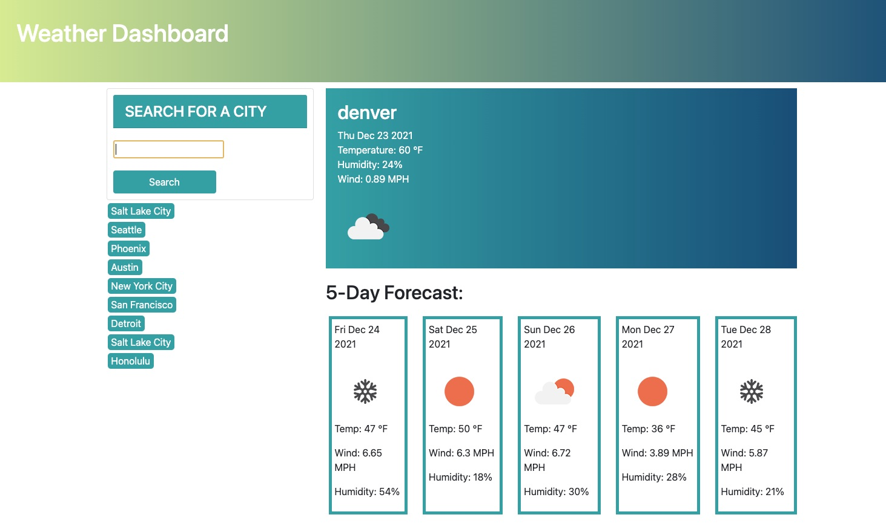

# Weather Dashboard

## Description
This project was created so that a user can check the current weather along with a five day forecast for any city. They are presented with the wind speed, humidity, date, and temperature. A list of their recent searches shows up for easy access on the left side of the page.

This project utilizes the openweather API, local Storage, JavaScript, Jquery, and Bootstrap. I learned how to read the documentation for an API, add an icon from an API and style using bootstrap.

## Usage
A user enters a city they would like to visit. They are then presented with the current weather as well as a five day forecast. Their recent searches show up on the left side of the page for easy access.

## Credits
T.A. Eric Sayer and tutor Armando Osario
## License
MIT License

Copyright (c) 2021 Sabriel Gee

Permission is hereby granted, free of charge, to any person obtaining a copy of this software and associated documentation files (the "Software"), to deal in the Software without restriction, including without limitation the rights to use, copy, modify, merge, publish, distribute, sublicense, and/or sell copies of the Software, and to permit persons to whom the Software is furnished to do so, subject to the following conditions:

The above copyright notice and this permission notice shall be included in all copies or substantial portions of the Software.

THE SOFTWARE IS PROVIDED "AS IS", WITHOUT WARRANTY OF ANY KIND, EXPRESS OR IMPLIED, INCLUDING BUT NOT LIMITED TO THE WARRANTIES OF MERCHANTABILITY, FITNESS FOR A PARTICULAR PURPOSE AND NONINFRINGEMENT. IN NO EVENT SHALL THE AUTHORS OR COPYRIGHT HOLDERS BE LIABLE FOR ANY CLAIM, DAMAGES OR OTHER LIABILITY, WHETHER IN AN ACTION OF CONTRACT, TORT OR OTHERWISE, ARISING FROM, OUT OF OR IN CONNECTION WITH THE SOFTWARE OR THE USE OR OTHER DEALINGS IN THE SOFTWARE.